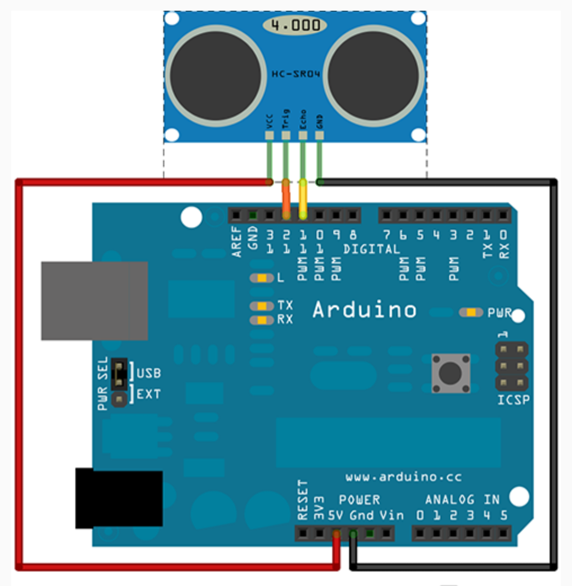
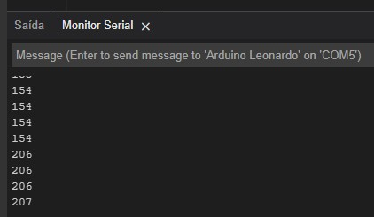
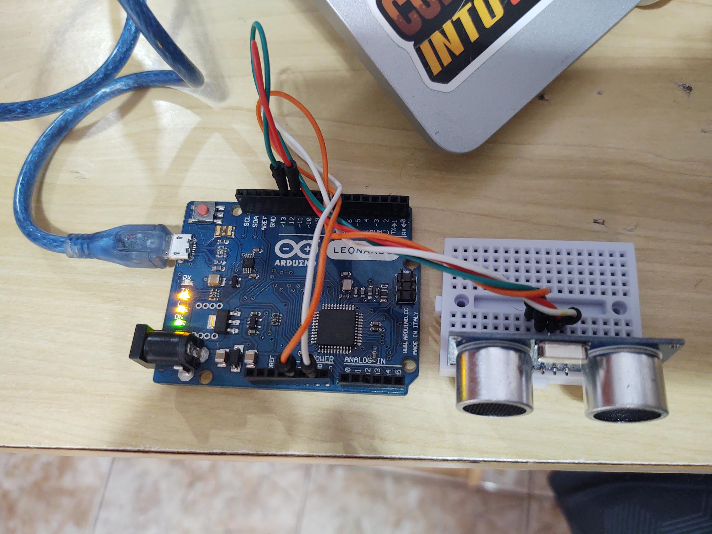
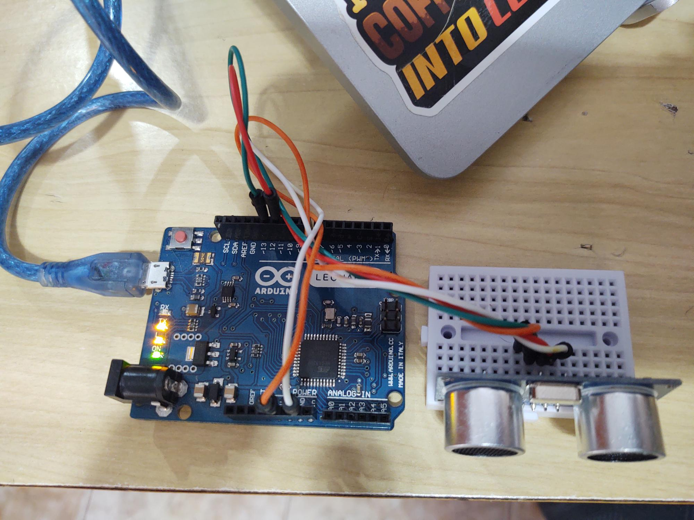
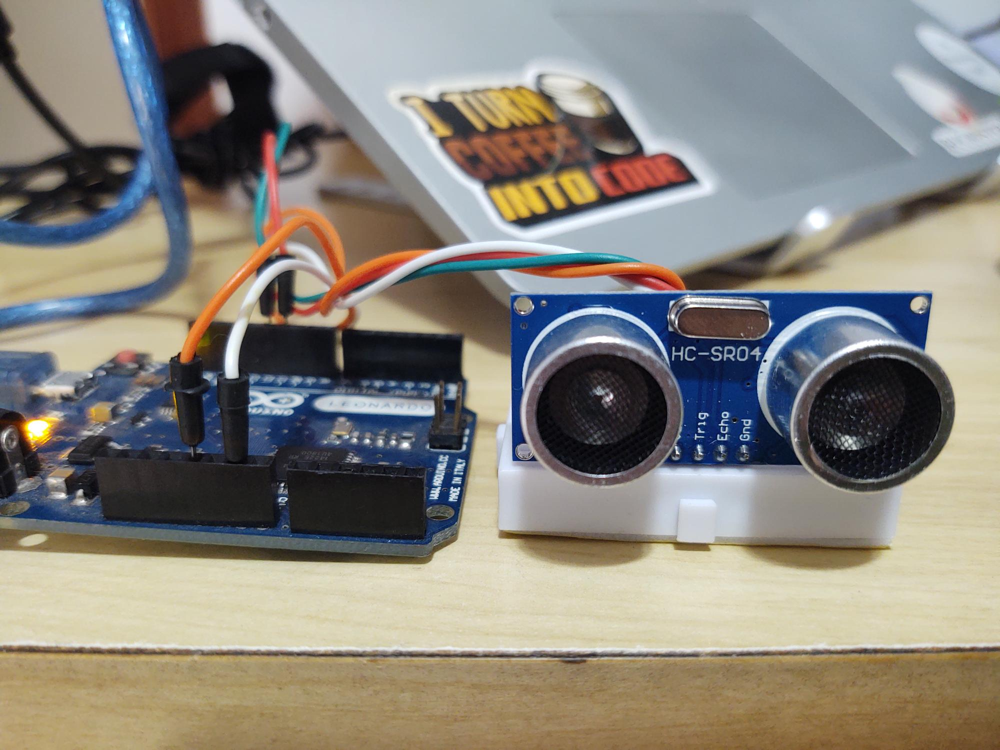
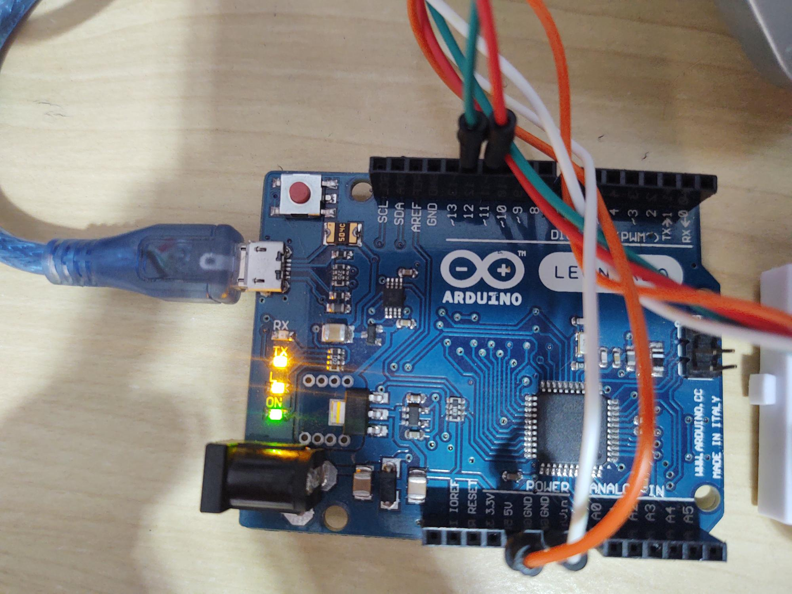

# Trena_Ultrassom_Arduino
 <h2>Projeto Arduino - Trena tipo Ultrassom</h2>
 
Foram utilizados nesse projeto (teste) uma placa sensora de distância por ultrassom, modelo HC-SR04 e, podem ser utilizados quaisquer produtos da linha Arduino.
 Especificamente nesse projeto testei tanto em um Arduino Uno (imagem 1) como em um Arduino Leonardo.

 
A indicação da distância foi obtida através do Monitor Serial da ferramenta Arduino IDE (imagem 2).
 
 
A máxima distância medida foi de 12 metros.

 

 
Imagem 1: Representação da distribuição da pinagem e ligações em um Arduino Uno

 

 

 
Imagem 2: Monitor Serial (com o Arduino Leonardo) obtida na IDE da ferramenta: as distâncias informadas estão em centímetros

 

 <table>
  <tr>
   <td>
   

   </td>
   <td>
   

   </td>
   </tr>
    <td>
    

    </td>
    <td>
    

    </td>
   </tr>
  </table>
